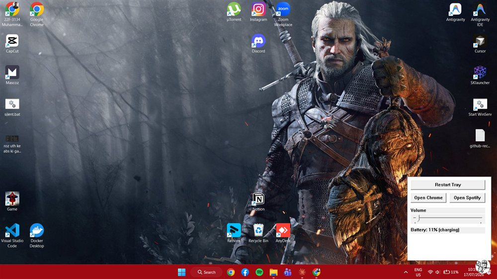

<p align="center">
  
</p>

<h1 align="center">TrayGuardian</h1>

<p align="center">
  A tiny, native Windows watchdog + quick-access panel for when your system tray icons disappear.
</p>

---

## Why

Sometimes on boot, Windows' notification area (`explorer.exe`'s tray) fails to initialize and your tray icons just don't show up. TrayGuardian fixes this two ways:

1. **Auto-heal watchdog**: ~18 seconds after login, it checks whether the tray actually initialized. If not, it restarts `explorer.exe` automatically to bring your icons back.
2. **Floating quick panel**: a small round bubble sits in the bottom-right corner. Click it (or press `Ctrl+Shift+T`) to open a lightweight panel with a manual tray-restart button, volume control, battery status, and quick-launch buttons for your apps.

Built in Rust with raw Win32 bindings, no Electron, no .NET runtime. The whole thing is a ~330 KB binary using single-digit-to-low-teens MB of RAM.

## Screenshot



## Features

- **Boot-time watchdog** that detects a broken tray and restarts `explorer.exe` for you.
- **Floating bubble** (bottom-right corner) with a gentle idle bobbing animation, cropped to a smooth anti-aliased circle.
- **Quick panel** (`Ctrl+Shift+T` or click the bubble) with:
  - Manual **Restart Tray** button
  - **Volume** slider (system master volume)
  - Live **battery %** status
  - Quick-launch buttons (Chrome, Spotify, easy to extend)
- Smooth slide + fade animations on open/close.
- Auto-start on login (optional, via a registry `Run` key).

## Getting started

### Run it

Double-click **[start.bat](start.bat)**, that's it. It launches the app silently in the background.

To stop it, double-click **[close.bat](close.bat)**.

### Auto-start on login

```powershell
& "target\release\tray_guardian.exe" --install
```

This writes a `HKCU\...\Run` registry entry so it launches automatically every time you log in. To undo it:

```powershell
Remove-ItemProperty -Path "HKCU:\Software\Microsoft\Windows\CurrentVersion\Run" -Name "TrayGuardian"
```

### Build from source

Requires the [Rust toolchain](https://rustup.rs/) (GNU target recommended, no Visual Studio needed):

```powershell
rustup toolchain install stable-x86_64-pc-windows-gnu
rustup default stable-x86_64-pc-windows-gnu
cargo build --release
```

The binary is produced at `target\release\tray_guardian.exe`. The bubble icon (`assets/handyman.jpg`) is embedded into the binary at compile time, so no external files are needed at runtime. To use a different icon, replace `assets/handyman.jpg` and rebuild.

## Configuration

Quick-launch app paths are set as constants near the top of [src/main.rs](src/main.rs):

```rust
const CHROME_PATH: &str = "C:\\Program Files\\Google\\Chrome\\Application\\chrome.exe";
const SPOTIFY_PATH: &str = "C:\\Users\\gamer\\AppData\\Local\\Microsoft\\WindowsApps\\Spotify.exe";
```

The hotkey (`Ctrl+Shift+T`) is registered in `main()` via `RegisterHotKey`.

## How it works

- **Watchdog**: checks for `Shell_TrayWnd` -> `TrayNotifyWnd` window existence via `FindWindowW`; if missing, force-restarts `explorer.exe`.
- **Panel/bubble animation**: driven by a `WM_TIMER` loop stepping window position (`SetWindowPos`) and opacity (`SetLayeredWindowAttributes` / `UpdateLayeredWindow`) with eased interpolation, no external animation library.
- **Bubble rendering**: the icon is loaded via GDI+, rendered at 2x resolution with a soft circular alpha mask, then box-filtered down to the final size and pushed to a layered window via `UpdateLayeredWindow`, giving a properly anti-aliased round bubble instead of a hard-edged clip region.

## License

Personal utility project, use and modify freely.
